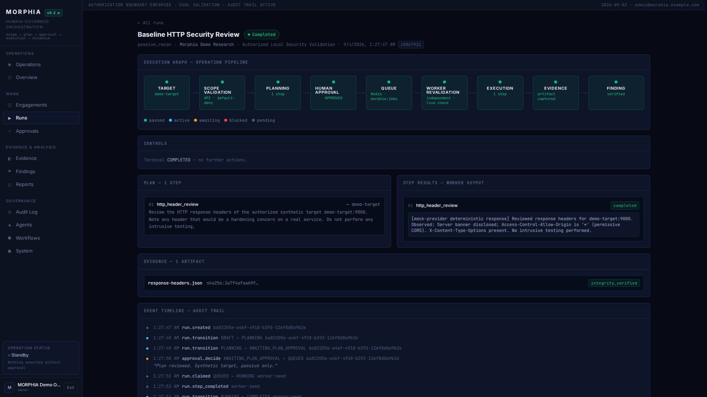

# MORPHIA

**Human-in-the-loop orchestration for authorized security research.**

Scoped engagements, auditable execution, evidence integrity, and
disclosure-ready reports — with a human approval gate before anything touches a
target.



> **Status: MVP / alpha.** The end-to-end journey works against a live stack and
> is covered by service-backed integration tests and a browser E2E suite (see
> `docs/mvp-verification.md`). It is not production-hardened — see
> [Limitations](#limitations).

---

## What it is

MORPHIA is a platform-independent workspace for running bug-bounty and
vulnerability-disclosure work the way a careful team actually does it:

- **Projects → engagements → explicit scope.** Every engagement carries an
  authorization basis and an include/exclude scope list.
- **Runs under a state machine.** A run moves `DRAFT → PLANNING →
  AWAITING_PLAN_APPROVAL → QUEUED → RUNNING → COMPLETED` (10 states, one
  legal-transition table, enforced server-side).
- **A human approves before execution.** The run pauses at
  `AWAITING_PLAN_APPROVAL`; nothing is queued for a worker until a person
  approves it.
- **Scope is checked twice.** Once by the API when the run is approved, and
  again by the worker immediately before it executes each step — independently,
  against live data. An out-of-scope target fails the run with the reason
  recorded.
- **Evidence has integrity.** Every artifact is SHA-256 hashed at capture and
  carries provenance and a verification lifecycle.
- **Findings become reports.** A verified finding can be assembled into a
  HackerOne-style disclosure report, exportable as Markdown, HTML, or JSON.
- **Everything is audited.** Auth, scope changes, approvals, run transitions,
  evidence, findings, and reports all write to an append-only audit log.

MORPHIA is **not** an autonomous attack tool. There is no code path that reaches
a tool invocation without first clearing scope and (for the plan) a human.

## Why it exists

The first version of this was coupled to a single hosting platform's auth,
storage, and deploy primitives — which broke the core requirement that a
security team be able to self-host it on their own infrastructure. MORPHIA is
the cloud-neutral rebuild: plain Postgres rows for sessions, plain Redis for the
queue, the S3 API for blobs, 100% environment-variable config, no vendor SDK in
business logic. Full rationale in `docs/recovery-audit.md`.

## Key capabilities

| Area | State |
|---|---|
| Auth (register/login/logout/me), Argon2id, server-side sessions, CSRF, per-IP rate limiting | Implemented, tested |
| RBAC (6 roles), ownership isolation on every resource fetch | Implemented, tested |
| Projects, engagements, scope rules + 8-point default-deny scope validator | Implemented, tested |
| Run state machine (10 states, legal-transition table, approval gates) | Implemented, tested |
| Redis queue hand-off + authenticated worker-callback API (`claim` / `steps` / `transition`) | Implemented, tested |
| Worker execution via pluggable provider (mock / OpenAI / OpenRouter / local) | Implemented; mock path is the demo default |
| Evidence: SHA-256 integrity, local/S3 storage, verification lifecycle | Implemented, tested |
| Findings: 10-state lifecycle + verification records | Implemented, tested |
| Reports: draft→final, Markdown/HTML/JSON export, HackerOne-style template | Implemented, tested |
| React SPA: dashboard, projects, run detail, approvals, evidence, findings, reports, audit log | Implemented |
| Synthetic local demo target + one-command demo + scope-enforcement proof | Implemented |

## Architecture

```
Browser ── React SPA (apps/web)
   │  HTTPS / JSON / session cookie + CSRF
   ▼
FastAPI (apps/api) ──SQLAlchemy async──▶ PostgreSQL 16   (system of record)
   │                                     Storage (local FS / S3)  ── evidence blobs
   └── Redis client ──▶ Redis 7 ──BRPOP──▶ Worker (apps/worker)
                                            │  authenticated callbacks (X-Worker-Auth)
                                            └─▶ Provider adapter (mock / OpenAI-compatible)
```

Scope → validation → approval → execution → evidence → finding → report, with
the audit log spanning the whole chain. See `docs/architecture.md` and
`docs/assets/architecture.svg`.

## Tech stack

| Layer | Technology |
|-------|-----------|
| Frontend | React 19, TypeScript, Vite 6, Tailwind CSS 4, TanStack Query |
| API | Python 3.11+, FastAPI, Pydantic v2, SQLAlchemy 2 (async), Alembic |
| Database | PostgreSQL 16 |
| Queue | Redis 7 |
| Worker | Python long-running process, provider adapters |
| Storage | Local filesystem (dev) / S3-compatible (prod) |
| Testing | pytest, vitest, Playwright |

## Quick start

**Prerequisites:** Docker + Docker Compose v2, and Python 3 on the host (for
`.env` generation).

```bash
git clone https://github.com/Rishidar-lab/Morphia.git
cd Morphia
make demo          # or: ./scripts/demo.sh
```

`make demo` builds the images, starts the six services, runs migrations, seeds
the demo workspace, verifies health, and then drives one allowed run and one
out-of-scope run live to prove scope enforcement. It prints the UI URL and the
ephemeral local demo credentials at the end.

- Web UI: http://localhost:5173
- API docs: http://localhost:8000/api/docs
- Synthetic demo target: http://localhost:9000

Stop it with `make demo-down`; wipe the database and rebuild with
`make demo-reset`.

### Manual

```bash
cp .env.example .env       # then set SECRET_KEY, WORKER_AUTH_SECRET, SEED_ADMIN_PASSWORD
docker compose up -d --build
docker compose exec -w /app/apps/api api alembic upgrade head
docker compose exec api python -m app.seed
```

## Demo mode

The seeded **"Morphia Demo Research"** workspace already contains an authorized
engagement, an allowed scope, a completed run with a hash-verified evidence
artifact, a verified (clearly-synthetic) finding, and a disclosure-style report.

`./scripts/demo.sh --journey` (stack already up) drives two fresh runs through
the real API and worker:

- **CASE A** — target `demo-target` (in scope) → run **COMPLETED**
- **CASE B** — target `production.example.com` (out of scope) → run **FAILED**,
  refused by the worker's independent scope re-check, reason on the timeline

The demo target (`apps/demo-target/server.py`) is a ~90-line stdlib HTTP service
that serves fixed synthetic payloads. Nothing about the demo touches a real
external system.

For recording a walkthrough, see `docs/demo-script.md`,
`docs/demo-shot-list.md`, `docs/demo-narration.md`, and
`scripts/prepare-demo.sh`.

## Security boundaries

- **Authorization before execution** — every target validated against the
  engagement's stored scope, never against agent-supplied claims.
- **Scope before tools** — the 8-point check is default-deny and runs twice, in
  two processes.
- **Human approval before intrusive actions** — `AWAITING_PLAN_APPROVAL` /
  `AWAITING_ACTION_APPROVAL` are explicit states.
- **Evidence before conclusions** — a finding can't be verified without linked
  evidence; a report can't include an unverified finding.
- **Worker is least-privilege** — no database access, a distinct shared-secret
  identity, restricted to callback endpoints.

Threat model in `docs/security.md`; what is and isn't enforced in
`docs/mvp-verification.md` § Security review.

## Testing

```bash
make verify                       # ruff + ruff format + mypy + pytest (api & worker) + vitest
cd apps/web && npm run build      # production build (Tailwind compiled)
make demo && cd tests/e2e && npm test   # live Playwright MVP-journey suite
```

CI (`.github/workflows/ci.yml`) runs: Python quality, worker quality, frontend
quality + build, Docker image build, a **service-backed integration** job
(compose up → migrate → seed → live journey → scope proof), a **Playwright E2E**
job (report uploaded as an artifact), and secret scanning.

Current: 60 API + 8 worker + 37 web unit tests, 4 live Playwright tests — all
green. Evidence matrix: `docs/mvp-verification.md`.

## Project status

**MVP / alpha.** The journey in `docs/mvp-verification.md` is fully working and
verified against a live stack. What was fixed to get here is itemised in
`docs/mvp-gap-analysis.md`.

## Limitations

- **Single-tenant demo posture.** RBAC and ownership checks are real, but there
  is no organization/tenant model and no admin UI for user/role management.
- **Separation of duties on approvals is not enforced** — a run's creator can
  currently approve their own run (`docs/security.md` §1.12 describes this as a
  control).
- **The worker executes an LLM step, not real security tooling.** A step's
  output is a model response, not proof a scan ran. Real tool adapters
  (nuclei/subfinder/…) are a separate, unbuilt feature.
- **SSRF deny-list and upload magic-byte validation are described in
  `docs/security.md` but not implemented.**
- **No production deployment configuration** — the compose file is dev-grade
  (bind mounts, dev credentials, `DEBUG=true`, no TLS). `infra/deployment/` is
  empty.
- **Backup/restore scripts exist but are unexercised.**
- **Provider selection is process-wide**, not per-run.

## Roadmap

- Organization/tenant model + user & role management UI
- Enforce approver ≠ run creator
- SSRF deny-list + DNS-rebinding checks in the scope validator
- Content-type/magic-byte validation on evidence upload
- Real tool-adapter execution in the worker, sandboxed
- Production deployment manifests + a verified backup/restore drill
- Per-run / per-engagement provider selection

## License

Private. All rights reserved.
